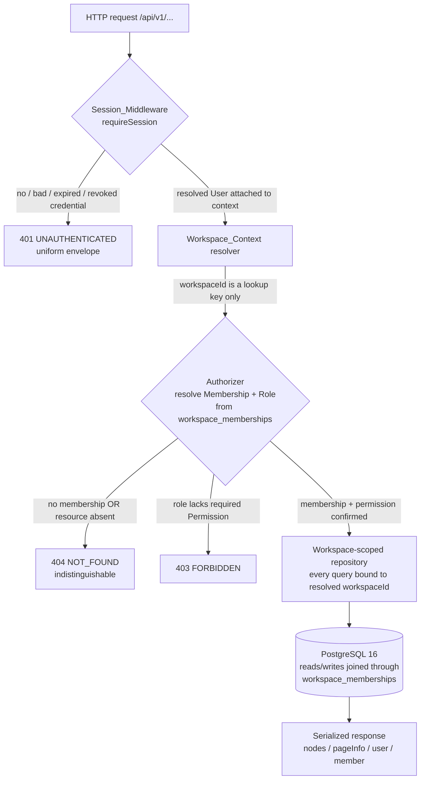

# Design: Authentication and Tenant Isolation

## Overview

This feature closes the two gaps named in the requirements introduction: Berry has no real sign-in, and
workspace isolation holds today only by convention. It delivers password-based authentication screens in
the Next.js frontend and turns workspace isolation into a **structurally enforced, testable** property at
the request boundary and the data layer — without changing the `/api/v1` wire contract, the opaque
session-token mechanism (`server-ts/src/auth/sessions.ts`), the stable error envelope
(`server-ts/src/http/errors.ts`), cursor pagination, or `Idempotency-Key` semantics
(Requirement 12).

The stack is unchanged and constrains every decision below: a TypeScript Hono server run directly under
`node --experimental-strip-types` (no build step, `erasableSyntaxOnly` — so no `enum`, no `namespace`, no
parameter properties), Zod v4 at the boundary, PostgreSQL 16 as the authority with forward-only immutable
migrations, and a Next.js App Router frontend. Password hashing uses `node:crypto` `scrypt` with a
per-user salt and `timingSafeEqual`, which needs no non-permissive dependency and runs under stripped
types. The SaaS Builder power informs the shape only — tenant-per-workspace, session-derived tenant
context, RBAC at the boundary, no-cross-tenant-leakage as a first-class property — and none of its AWS
infrastructure is used.

### How the design maps to the twelve requirements

| Requirement | Where it is realized in this design |
|---|---|
| **1. Password sign-in** | New `password_hash`/`password_salt` columns on `users`; `SessionService.issuePassword` verifying with `scrypt` + `timingSafeEqual`; `POST /api/v1/auth/sign-in`. Uniform 401 `UNAUTHENTICATED` for unknown email and wrong password. |
| **2. Sign-up** | `POST /api/v1/auth/sign-up` creating a user, hashing the password, issuing a session, returning 201; `Idempotency-Key` reuses the existing fingerprint pattern (`workspaces.create`); 409 `CONFLICT` on duplicate email. |
| **3. Session lifecycle** | Existing `SessionService` (opaque token, SHA-256-only storage, atomic liveness+`last_used_at`, `revokeSession`); TTL bounds validated at issue time; `POST /api/v1/auth/sign-out` returns 204 for any token. |
| **4. Auth required** | Existing `requireSession` (`server-ts/src/auth/middleware.ts`) — uniform 401, single Authorization header, credential errors never 500. |
| **5. Server-derived context** | New `WorkspaceContext` resolver + a mandatory workspace-scoped repository wrapper so a handler cannot query workspace data without first resolving membership from the session; `workspaceId` is only ever a lookup key. |
| **6. No cross-workspace read** | The scoped repository joins `workspace_memberships` on every read; identical 404 for other-workspace vs non-existent; empty collections for a member of no workspace. |
| **7. No cross-workspace write** | The scoped repository resolves a resource's owning workspace from stored data, checks the permission, verifies referenced resources share the workspace, and does the write in one transaction. |
| **8. RBAC** | Existing `allows(role, permission)` matrix (`server-ts/src/identity/roles.ts`), enforced inside the scoped repository's `authorize` step. |
| **9. Auth screens** | New App Router sign-in / sign-up / sign-out screens using `frontend/lib/session.ts` (in-memory + `sessionStorage`), never `NEXT_PUBLIC_`. |
| **10. Onboarding** | New `users.last_workspace_id`-backed selection (already present), create/join flows over existing `WorkspaceRepository.create`/`select` and `SecretsRepository.acceptInvitation`; onboarding UI. |
| **11. Passwordless gating** | Existing `loginAllowed` gate in `server-ts/src/mounts/auth.ts`, kept and made explicit; 404 `ROUTE_NOT_FOUND` outside dev/test or when the flag is off. |
| **12. Wire contract** | No change to serialized `user`/`workspace`/`member` shapes; same envelope, cursor pagination, and idempotency helpers reused verbatim. |

## Architecture

Every workspace-scoped request passes through four stages in order. The security property is that no
workspace data is reachable until all four have run, and stage 2 (Workspace_Context) can only be derived
from stage 1's resolved user — never from the request body, headers, or query string (Requirement 5.2).



Stages, mapped to the existing modules:

1. **Session_Middleware** — `requireSession(sessions)` in `server-ts/src/auth/middleware.ts`, unchanged.
   It admits exactly one `Bearer` credential, resolves it through `SessionService.resolveCredential`
   (session token or `berry_pat_` PAT), attaches the `User`, and answers every failure with the identical
   401 (Requirements 4.1–4.7, 3.4, 3.5, 3.8, 3.9). A resolution error is caught and returned as 401, never
   500 (Requirement 4.7).

2. **Workspace_Context resolver** — a new helper, `resolveWorkspaceContext`, that takes the resolved
   `User` and a *lookup* `workspaceId` (from path or query) and returns `{ workspaceId, role }` **only**
   after confirming membership. It is the single place a `workspaceId` string becomes a trusted scope. It
   never reads a role or workspace claim from the request (Requirement 5.1, 5.2, 5.4).

3. **Authorizer** — the existing `BoardRepository.authorize` / `authorizeWorkspace`
   (`server-ts/src/core/boards.ts`) and `WorkspaceRepository` membership joins, which resolve a resource's
   owning workspace from stored data and enforce a `Permission` via `allows(role, permission)`. Non-member
   and non-existent both raise `NotFound` → identical 404 (Requirements 5.5, 5.6, 6.2, 6.3, 7.1, 8).

4. **Workspace-scoped repository** — the structural mechanism (see *Components*). It wraps the raw `Sql`
   handle so that a workspace-scoped query is impossible to write without a `WorkspaceContext`, replacing
   "each handler remembers to call authorize" with "a handler cannot obtain a query surface until it has".

### The structural enforcement decision (Requirements 5, 6, 7)

The requirements are explicit that isolation must not rest on each handler remembering to call `authorize`
(introduction, gap 2). Three mechanisms were considered:

- **A. PostgreSQL Row-Level Security (RLS) with `SET LOCAL app.user_id`.** Strongest defense in depth, but
  it requires a session GUC on every transaction and a policy per table, is invisible in the TypeScript
  types (a forgotten `SET` fails open to *no* rows, which is safe, or to a misconfigured policy, which is
  not), and reads awkwardly against the existing `postgres`-driver pooling. Deferred as a possible future
  hardening, not the primary mechanism.

- **B. A mandatory `authorize` step wired into the mount** (middleware that runs `resolveWorkspaceContext`
  before the handler). Good, but a handler can still reach the raw `Sql` and query another workspace by
  mistake; the check and the query are separable.

- **C (chosen). A workspace-scoped repository wrapper** whose only constructor is `WorkspaceContext`.
  A handler receives a `ScopedDb` bound to one confirmed `workspaceId`; its query methods always inject
  `workspace_id = $ctx` (directly, or via a join through `workspace_memberships`). There is no method on
  `ScopedDb` that returns cross-workspace rows, so writing a leak requires deliberately bypassing it and
  reaching for the raw handle — which code review and a lint rule can flag. This fits the existing
  repository/`authorize` pattern (it *is* that pattern, made non-optional) and keeps everything in
  TypeScript with no driver changes.

Chosen: **C**, with **B** as the mount wiring that constructs the `ScopedDb`, and **A** noted as future
defense-in-depth. The read mounts that today take a client-supplied `workspaceId`
(`server-ts/src/mounts/workspace-reads.ts` — `search`/`views`/`catalogs`) are migrated to obtain their
`ScopedDb` from `resolveWorkspaceContext`, so the `workspaceId` query parameter becomes a pure lookup key
that is re-derived against membership before any row is returned (Requirement 5.4).

## Components and Interfaces

All server type names below avoid `enum`/`namespace`/parameter-properties (`erasableSyntaxOnly`).

### 1. Password credential storage and verification (Requirements 1.5, 1.6, 2.1)

`node:crypto` `scrypt` with a per-user random salt. No third-party dependency; runs under stripped types.

```ts
// server-ts/src/auth/password.ts
import { randomBytes, scrypt as scryptCb, timingSafeEqual } from 'node:crypto';

// N=2^15, r=8, p=1 — OWASP-aligned for interactive login; keyLen 32, salt 16.
export const SCRYPT_PARAMS = { N: 32768, r: 8, p: 1, keyLen: 32, saltBytes: 16 } as const;

export interface StoredPassword {
   salt: Buffer;   // per user, stored in users.password_salt (bytea)
   hash: Buffer;   // scrypt digest, stored in users.password_hash (bytea)
}

/** Derives a fresh salt+hash for a new or rotated password. */
export function hashPassword(password: string): Promise<StoredPassword>;

/**
 * Constant-time verify. Always runs a scrypt derivation — including a dummy
 * one when the user has no stored password — so timing does not reveal whether
 * an email is registered (Requirement 1.4, 1.6).
 */
export function verifyPassword(password: string, stored: StoredPassword | null): Promise<boolean>;
```

`verifyPassword(_, null)` still performs a derivation against a fixed dummy salt and returns `false`, so
"unknown email" and "wrong password" take the same code path and the same time (Requirements 1.2–1.4).
The `scrypt` maxmem is raised to accommodate `N=32768`.

### 2. Session lifecycle changes (Requirement 3)

`SessionService` (`server-ts/src/auth/sessions.ts`) already: generates a 256-bit token, stores only its
SHA-256 hash, resolves liveness and stamps `last_used_at` in one atomic statement, and revokes by hash
(no-op for unknown tokens). This feature adds one issuance path and one guard:

```ts
// added to SessionService
/** Verifies a password against the stored user, then issues via the shared path. */
issuePassword(email: string, password: string, meta?: SessionMetadata): Promise<IssuedSession>;
/** Used by sign-up: issues for a freshly created user id in the same transaction. */
issueForUser(userId: string, meta?: SessionMetadata): Promise<IssuedSession>;
```

Both funnel into the existing token-generation + insert used by `issueKnownEmail`, so passwordless login
and password login share one issuance path (Requirement 11.3).

**TTL bounds (Requirements 3.1, 3.2).** The constructor already rejects a non-positive TTL. It is
tightened to reject a TTL outside 300..2,592,000 seconds by throwing a typed `ConfigError` at issue time;
the mount maps that to HTTP 500 with an `INTERNAL` envelope indicating a server configuration error, and
no token is issued. `config.sessionTtlMs` already defaults to 2,592,000,000 ms (30 days), the upper bound.

### 3. Sign-in / sign-up / sign-out endpoints (Requirements 1, 2, 3.6, 3.7)

Added to `server-ts/src/mounts/auth.ts`, all under `/api/v1/auth`, all using the bounded-body reader
already there (`MAX_LOGIN_BODY_BYTES = 4096`, Requirement 1.7) and the shared error envelope:

- `POST /api/v1/auth/sign-in` — Zod-validated `{ email, password }`; on success returns
  `{ token, expiresAt, user }` (existing shape); unknown email / wrong password → uniform 401
  `UNAUTHENTICATED`.
- `POST /api/v1/auth/sign-up` — Zod-validated `{ email, password }`; honors `Idempotency-Key` via the
  fingerprint pattern from `WorkspaceRepository.create`; 201 with `{ token, expiresAt, user }`; duplicate
  email → 409 `CONFLICT`; policy violations → 422 `VALIDATION_FAILED` naming `/email` or `/password`.
- `POST /api/v1/auth/sign-out` — reuses the existing `/logout` handler behavior: `requireSession`, then
  `revokeSession(token)`, always 204 (Requirements 3.6, 3.7). `/logout` is retained as an alias so the
  current frontend keeps working during migration.

The existing `POST /api/v1/auth/login` (passwordless) and `GET /api/v1/auth/me` are unchanged.

### 4. Structural isolation mechanism — `ScopedDb` (Requirements 5, 6, 7)

```ts
// server-ts/src/identity/workspace-context.ts
import type { Sql, Queryable } from '../db/pool.ts';
import type { Permission } from './roles.ts';

export interface WorkspaceContext {
   readonly workspaceId: string;
   readonly userId: string;
   readonly role: string; // one of ROLES; unknown value grants nothing via allows()
}

/**
 * Resolves the caller's context for a *lookup* workspaceId. Confirms membership
 * against workspace_memberships before returning; NotFound (→ 404) if the caller
 * is not a member or the workspace does not exist — indistinguishable
 * (Requirement 5.5). The workspaceId is never trusted as a scope until this returns.
 */
export function resolveWorkspaceContext(
   sql: Queryable,
   userId: string,
   workspaceId: string,
   required: Permission,
): Promise<WorkspaceContext>;

/**
 * A query surface bound to exactly one confirmed workspace. Every method injects
 * `workspace_id = ctx.workspaceId` (or a membership join). There is deliberately
 * no method that returns cross-workspace rows.
 */
export interface ScopedDb {
   readonly ctx: WorkspaceContext;
   /** SELECT within the scope. The workspace predicate is added by the wrapper. */
   list<T>(build: (q: ScopedQuery) => Promise<T[]>): Promise<T[]>;
   /** Resolve a resource's owning workspace from stored data; 404 if it is not ctx's. */
   requireResource(table: string, id: string): Promise<void>;
   /** Run authorize + write in one transaction that rolls back on any failure (Req 7.6). */
   mutate<T>(required: Permission, work: (tx: Queryable, ctx: WorkspaceContext) => Promise<T>): Promise<T>;
}

export function scopedDb(sql: Sql, ctx: WorkspaceContext): ScopedDb;
```

Mount wiring (mechanism **B** constructing mechanism **C**):

```ts
// pattern used by every workspace-scoped mount
route.use('/:workspaceId/*', requireSession(sessions));
route.use('/:workspaceId/*', async (c, next) => {
   const ctx = await resolveWorkspaceContext(sql, c.get('user').id, pathId(c.req.param('workspaceId'), 'Workspace'), 'product.read')
      .catch(rethrowAsNotFound); // NotFound|Forbidden → 404, uniform
   c.set('scoped', scopedDb(sql, ctx));
   await next();
});
```

`resolveWorkspaceContext` maps `Forbidden` from `authorizeWorkspace` to `404 NOT_FOUND` when the failure
would reveal membership, matching `workspace-reads.ts`'s existing `authorizeWorkspace` catch, and keeps
`403 FORBIDDEN` for a member whose role lacks a *write* permission (Requirement 7.3, 8.3).

### 5. RBAC enforcement (Requirement 8)

Unchanged matrix in `server-ts/src/identity/roles.ts`: `allows(role, permission)` returns `false` for any
unrecognized role, so a corrupt role grants nothing (Requirement 8.3). `ScopedDb.mutate(required, …)`
calls `allows(ctx.role, required)` before issuing a write and throws `Forbidden` → 403 otherwise
(Requirements 8.4–8.7). Reads require membership only (`product.read`), matching current behavior.

### 6. Passwordless gating (Requirement 11)

`loginAllowed(config)` in `server-ts/src/mounts/auth.ts` is retained and is the single gate: passwordless
`POST /api/v1/auth/login` returns `404 ROUTE_NOT_FOUND` unless `APP_ENV` is `development`/`test` **and**
`AUTH_ALLOW_PASSWORDLESS_LOGIN` is on (Requirements 11.1, 11.2). When allowed, it issues through the same
`SessionService` path as password sign-in (Requirement 11.3) and refuses an unknown/inactive account with
the invalid-credentials envelope (Requirement 11.4).

### 7. Frontend Auth_UI (Requirements 9, 10)

New App Router screens under `frontend/`, using the existing token holder (`frontend/lib/session.ts`:
in-memory closure + tab-scoped `sessionStorage`) and `apiFetch` (`frontend/lib/api.ts`). The token is
never placed in a URL, build config, or a `NEXT_PUBLIC_` variable (Requirement 9.3); credentials go only
to the Berry API via same-origin rewrites (Requirement 9.6).

- **`/sign-in`** — email + password form. Client-side required-field validation blocks empty submits with
  field-level errors (Requirement 9.8). On 401 it shows a neutral credential error that does not reveal
  whether the email is registered, and keeps the entered email (Requirement 9.5). On network error or any
  non-401 failure it shows a "could not complete" error and stays on the screen without a session
  (Requirement 9.9). On success it persists the token and routes into the workspace within 2s
  (Requirement 9.2).
- **`/sign-up`** — email + password (+ confirm) form calling `POST /api/v1/auth/sign-up`; on success it
  behaves like sign-in and enters onboarding.
- **Sign-out control** — calls `POST /api/v1/auth/sign-out`; on success clears both the in-memory holder
  and `sessionStorage` and returns to `/sign-in` (Requirement 9.4). If sign-out does not succeed within
  5s, it clears locally, returns to `/sign-in`, and shows a "session ended locally" notice
  (Requirement 9.10).
- **Auto-login removed when passwordless is off.** `store/session-store.ts` currently auto-logs-in as
  `AUTO_LOGIN_EMAIL`. The hydrate path is changed so that where passwordless login is disabled it does not
  auto-establish a session and requires an explicit sign-in before any protected route renders
  (Requirements 9.1, 9.7). The protected-route guard presents `/sign-in` for an anonymous visitor.
- **Onboarding** — after auth, `GET /api/v1/me/bootstrap` (existing) yields the user's workspaces and
  `currentWorkspaceId`. With ≥1 membership the UI routes into the selected workspace (previously selected
  if still valid, else earliest-joined) within 2s and does not force creation (Requirement 10.1). With no
  membership it shows a create-or-join step (Requirement 10.2): create calls `POST /api/v1/workspaces`
  (owner membership + selection set server-side, Requirement 10.3); join calls
  `POST /api/v1/invitations/:id/accept` (single-use, Requirements 10.6–10.8); select calls the
  workspace-select endpoint (Requirements 10.4, 10.5).

### 8. Session_Client (Requirement 9.3)

Unchanged: `createMemoryApiSession` keeps the raw token in a closure; `persistSessionToken` writes tab
`sessionStorage`; `clearSessionToken` clears both. `apiFetch` attaches `Authorization: Bearer <token>`.
No token in URL or `NEXT_PUBLIC_`.

## Data Models

PostgreSQL 16 is authoritative. Migrations are forward-only and immutable; **no applied migration is
edited**. This feature adds new migration files only. All new columns are additive with safe defaults so
the migration runs on an existing database. Byte-checksum + advisory-lock application is handled by the
existing runner (`server-ts/src/migrate/migrations.ts`).

### New migration 1 — password credentials on `users`

```sql
-- server-ts/migrations/050_user_password_credentials.up.sql
ALTER TABLE users ADD COLUMN IF NOT EXISTS password_hash bytea;
ALTER TABLE users ADD COLUMN IF NOT EXISTS password_salt bytea;
ALTER TABLE users ADD COLUMN IF NOT EXISTS password_updated_at timestamptz;

-- Both present or both absent: a half-set credential can never be verified.
ALTER TABLE users ADD CONSTRAINT users_password_pair_ck
   CHECK ((password_hash IS NULL) = (password_salt IS NULL)) NOT VALID;
-- scrypt digest is 32 bytes, salt is 16 (SCRYPT_PARAMS).
ALTER TABLE users ADD CONSTRAINT users_password_hash_len_ck
   CHECK (password_hash IS NULL OR octet_length(password_hash) = 32) NOT VALID;
ALTER TABLE users ADD CONSTRAINT users_password_salt_len_ck
   CHECK (password_salt IS NULL OR octet_length(password_salt) = 16) NOT VALID;
```

Nullable columns: existing backfilled users (and passwordless dev accounts) have no password and simply
cannot sign in via password until one is set — `verifyPassword(_, null)` returns `false` in constant time.
The `.down.sql` drops the three columns and constraints.

### New migration 2 — user selected workspace (already partly present)

`users.last_workspace_id` already exists (migration 004) with an FK `ON DELETE SET NULL` and is written by
`WorkspaceRepository.create/select/remove`. **No new column is required**; this design reuses it as the
"selected workspace" of Requirement 10. A migration is added only to add an index supporting the
selection read path if profiling shows one is needed; otherwise none is added. Documented here so the
decision is explicit rather than implied.

### New migration 3 — invitation single-use (already present)

`workspace_invitations` (migration 004) already models single-use consumption via `accepted_at` /
`accepted_by` / `revoked_at`, and `SecretsRepository.acceptInvitation` already marks an invitation
consumed inside a `FOR UPDATE` transaction and rejects any later presentation
(Requirements 10.6–10.8, 10.7). **No new migration is required** for invitation consumption; the design
uses the existing table and code path. This is called out explicitly so the requirement is traceably
satisfied by existing structure rather than assumed.

### Changed tables summary

| Table | Change | Migration | Requirement |
|---|---|---|---|
| `users` | + `password_hash bytea`, `password_salt bytea`, `password_updated_at timestamptz` (+ checks) | `050_user_password_credentials` (new) | 1.5, 2.1 |
| `users` | `last_workspace_id` reused as selected workspace | none (exists, 004) | 10.1, 10.3–10.5 |
| `sessions` | unchanged (`token_hash`, `expires_at`, `revoked_at`, `last_used_at` all present) | none | 3 |
| `workspace_memberships` | unchanged; the isolation boundary joined on every scoped query | none | 5, 6, 7 |
| `workspace_invitations` | unchanged; single-use via `accepted_at`/`accepted_by`/`revoked_at` | none | 10.6–10.8 |

### Zod v4 schemas at the API boundary

Validation lives at the boundary; storage-shape checks stay in the DB constraints above. Field-error
paths use JSON-Pointer style to match `fieldError` / `VALIDATION_FAILED`.

```ts
// server-ts/src/auth/schemas.ts (Zod v4)
import { z } from 'zod';

const email = z.string().trim().max(320).regex(/^[^\s@]+@[^\s@]+\.[^\s@]+$/); // Requirement 2.5
const password = z.string().min(12).max(128);                                 // Requirement 2.4

export const signInBody = z.object({ email, password }); // wrong/missing type → VALIDATION_FAILED (Req 1.8)
export const signUpBody = z.object({ email, password });
```

On a Zod failure the mount emits `422 VALIDATION_FAILED` with a `fields[]` detail naming the offending
path (Requirements 1.8, 2.4, 2.5); a body over 4096 bytes is `400` before parsing (Requirement 1.7); an
`Idempotency-Key` that is not 16–128 visible-ASCII characters is `422 VALIDATION_FAILED`
(Requirement 2.8), reusing the existing idempotency-key validator.

### Serialized shapes (unchanged — Requirement 12.7)

`serializeUser` (id, email, name, avatarUrl, role, createdAt, updatedAt — no `currentWorkspaceId`),
`toWorkspace`, and `toMembership` are used as-is. The password columns are never serialized
(Requirement 2.2). No field is added to or removed from `user`/`workspace`/`member`.

## Correctness Properties

*A property is a characteristic or behavior that should hold true across all valid executions of a
system — essentially, a formal statement about what the system should do. Properties serve as the bridge
between human-readable specifications and machine-verifiable correctness guarantees.*

Randomized property-based testing applies here because the security guarantees are universal statements — "for *any*
pair of workspaces, no cross-workspace access" — over a large input space (workspaces, users, memberships,
roles, rows, credentials) where randomized worlds surface edge cases far better than a handful of
examples. The four security guarantees named in the task (no cross-workspace read, no cross-workspace
write, unauthenticated rejection, server-derived context) plus session-lifecycle correctness are encoded
below. Purely presentational or timing criteria (most of Requirement 9, the 2s/5s deadlines, constant-time
*timing*) are covered by example/component tests in the Testing Strategy rather than as properties.

**Prework consolidation.** The per-criterion analysis was reduced to remove redundancy: the specific RBAC
denials (8.4–8.7) fold into the single RBAC-matrix property (P4); the indistinguishable-404 criteria
(5.5, 5.6, 6.2, 6.3, 7.1) share one 404-indistinguishability property (P3); the uniform-401 criteria
(3.9, 4.1–4.4, 8.2) share one property (P1); the idempotency criteria (2.6, 2.7, 12.4–12.6) share one
(P8). Each property below therefore provides distinct validation value.

Each property test is DB-backed unless noted and **self-skips when `BERRY_TEST_DATABASE_URL` is unset**.
Each runs a minimum of 100 iterations and is tagged
`Feature: auth-and-tenant-isolation, Property N: <text>`.

### Property 1: Unauthenticated and malformed credentials are uniformly rejected

*For all* requests to a protected endpoint whose credential is absent, wrong-scheme, empty or
whitespace-only, non-printable-ASCII, longer than 4096 characters, duplicated across two Authorization
headers, or well-formed but matching no active, non-expired, non-revoked session, the response is a
byte-for-byte identical `401 UNAUTHENTICATED` envelope (same status, body, and headers) and the route
handler is never invoked.

- **Generators/inputs:** a category tag ∈ {absent, wrongScheme, empty, whitespace, nonPrintable, tooLong,
  duplicateHeader, unknownButWellFormed} plus a random token body for each category.
- **Oracle:** a sentinel handler that records invocation; assert it is never called, and assert every
  response equals the first category's response byte-for-byte.
- **Validates: Requirements 3.9, 4.1, 4.2, 4.3, 4.4, 8.2**

### Property 2: No cross-workspace read

*For all* generated worlds (a set of workspaces, users, memberships with random roles, and workspace-owned
rows) and *for all* callers, every workspace-scoped list and search returns only rows whose owning
workspace is one in which the caller holds a membership; a caller with no membership receives an empty
collection.

- **Generators/inputs:** N workspaces, M users, random memberships (some users in none), K rows per
  workspace across boards/issues/labels/views; a random caller and a random list/search endpoint.
- **Oracle:** for every returned node, its `workspaceId` ∈ the caller's membership set; when that set is
  empty, the returned `nodes` array is empty.
- **Validates: Requirements 5.4, 6.1, 6.4, 6.5**

### Property 3: Cross-workspace and non-existent resources are indistinguishably absent

*For all* worlds and callers, requesting or mutating a single resource that belongs to a workspace the
caller is not a member of produces a `404 NOT_FOUND` response that is identical — in status, envelope
body, and response headers — to the response for a resource id that does not exist at all, and the stored
data is unchanged.

- **Generators/inputs:** a resource id drawn from {other-workspace resource, random non-existent uuid};
  a read or a mutation (create/update/delete) naming it.
- **Oracle:** the two response variants are byte-identical; a pre/post snapshot of all rows is equal.
- **Validates: Requirements 5.5, 5.6, 6.2, 6.3, 7.1**

### Property 4: Authorization grants exactly the role-permission matrix

*For all* roles (including values outside `owner|admin|member|viewer`) and *for all* permissions, the
Authorizer permits a workspace-scoped action if and only if `allows(role, permission)` is true; when it is
false the action is rejected with `403 FORBIDDEN` (for a member lacking the permission) and no stored data
is changed.

- **Generators/inputs:** the Cartesian product of `ROLES ∪ {corrupt}` × `PERMISSIONS`, paired with a
  mutation requiring that permission.
- **Oracle:** decision == `allows(role, permission)`; on denial, a pre/post snapshot is equal and the code
  is `FORBIDDEN`.
- **Validates: Requirements 7.2, 7.3, 8.1, 8.3, 8.4, 8.5, 8.6, 8.7**

### Property 5: Workspace context is server-derived and request claims are ignored

*For all* memberships and *for all* adversarial requests that assert a role, membership, or
workspace-authorization claim in the body, headers, or query string, the resolved `WorkspaceContext` role
equals the caller's role recorded in `workspace_memberships`, and a mutation naming a resource is scoped to
that resource's stored owning workspace regardless of any request-supplied `workspaceId`.

- **Generators/inputs:** a membership (user, workspace, role); an injected fake role/workspaceId placed in
  a random location (body/header/query) that differs from the truth; a resource owned by a known workspace.
- **Oracle:** `ctx.role` == DB role and `ctx.workspaceId` == the resource's stored workspace; the injected
  claim never changes the outcome.
- **Validates: Requirements 5.1, 5.2, 5.3**

### Property 6: Session issuance stores only a hash with a bounded expiry

*For all* issued sessions, the persisted row stores a value that is not the raw token but its SHA-256 hash,
the raw token decodes to at least 256 bits of entropy, and the stored expiry equals the issue time plus the
configured TTL (which lies within 300..2,592,000 seconds).

- **Generators/inputs:** random issue times and metadata; a fixed in-range TTL; repeated issuances.
- **Oracle:** `stored != rawToken`, `stored == sha256hex(rawToken)`, `decode(rawToken).length >= 32`,
  `expires_at == issued_at + ttl` within tolerance.
- **Validates: Requirements 3.1**

### Property 7: Session lifecycle round-trip — issue, resolve, revoke, stay rejected

*For all* issued sessions, resolving a live token returns the issuing user and advances `last_used_at`;
after the session is expired or revoked (including via sign-out, which returns 204), every subsequent
resolution of that token fails with `401 UNAUTHENTICATED`, and signing out with a token matching no stored
session also returns 204.

- **Generators/inputs:** a sequence of operations over a session: {resolve, expire, revoke, signOut,
  resolveAgain} in randomized valid orders; plus random unknown tokens for the no-op sign-out case.
- **Oracle:** live resolve → correct user and `last_used_at` strictly advanced; post-expiry/revocation
  resolves → unauthenticated on every attempt; sign-out → 204 for known and unknown tokens alike.
- **Validates: Requirements 3.3, 3.4, 3.5, 3.6, 3.7, 3.8**

### Property 8: Idempotent creation is a replay, and a key reuse with a different body is a conflict

*For all* creating POSTs (sign-up, workspace create) carrying an `Idempotency-Key`, replaying with the same
key and a byte-identical body returns the original result and creates no second resource; replaying the
same key with a non-identical body returns `409 IDEMPOTENCY_CONFLICT` and creates nothing; a request with
no key is always processed as new.

- **Generators/inputs:** a valid create request; a replay with {identical body, mutated body, no key}.
- **Oracle:** identical-body replay → same resource id and unchanged row count; mutated-body replay → 409
  and unchanged count; no-key → a fresh resource.
- **Validates: Requirements 2.6, 2.7, 12.4, 12.5, 12.6**

### Property 9: Sign-in credential outcomes are indistinguishable across failure kinds

*For all* generated (email, password) attempts, sign-in succeeds and issues a resolvable token exactly when
the email is registered and the password matches the stored hash; for an unknown email and for a registered
email with a wrong password the response is an identical `401 UNAUTHENTICATED` envelope.

- **Generators/inputs:** a set of registered users; attempts drawn from {correct, wrongPassword,
  unknownEmail}.
- **Oracle:** correct → 200 with a token that resolves to the user; the two failure kinds → byte-identical
  401 envelopes.
- **Validates: Requirements 1.1, 1.2, 1.3, 1.4**

### Property 10: Passwords are stored as distinct salted one-way hashes

*For all* passwords, the stored representation differs from the plaintext, and hashing the same password
twice (independently) yields different salts and different stored hashes, while `verifyPassword` accepts the
original password against its own stored pair and rejects any other password.

- **Generators/inputs:** random passwords (12..128 chars, including unicode); pairs of independent hashings.
- **Oracle:** `hash != utf8Bytes(password)`; `salt1 != salt2` and `hash1 != hash2`;
  `verifyPassword(pw, store) == true` and `verifyPassword(other, store) == false`.
- **Validates: Requirements 1.5, 2.1**

### Property 11: Invitation acceptance is single-use and idempotent for the invitee

*For all* valid, unexpired, unrevoked invitations issued to a user's own identity, accepting once creates
exactly one membership with the invitation's role and marks the invitation consumed; a second acceptance by
the same user creates no additional membership, and any presentation of an expired, revoked,
already-consumed (by another identity), or wrong-identity invitation is rejected and creates no membership.

- **Generators/inputs:** invitation state ∈ {valid, expired, revoked, alreadyAccepted, wrongIdentity};
  acceptance attempts, possibly repeated.
- **Oracle:** valid → membership count for (user, workspace) is exactly 1 after one-or-more accepts;
  invalid states → rejection and membership count 0.
- **Validates: Requirements 10.6, 10.7, 10.8**

### Property 12: Workspace selection follows previous-if-valid-else-earliest and select requires membership

*For all* users with a set of memberships and a (possibly stale) stored selection, the chosen workspace is
the previously selected one when that membership is still valid, otherwise the earliest-joined membership;
selecting a workspace the user belongs to records it as the selection, and selecting one the user does not
belong to returns `404 NOT_FOUND` and leaves the selection unchanged. Creating a workspace records the
creator as `owner` and sets the selection to the new workspace.

- **Generators/inputs:** memberships with random `joined_at`; a stored selection ∈ {valid, stale, null};
  select targets ∈ {member, non-member}.
- **Oracle:** chosen workspace equals the pure selection rule; member-select → selection updated;
  non-member-select → 404 and selection unchanged; create → owner membership present and selection == new id.
- **Validates: Requirements 10.1, 10.3, 10.4, 10.5**

### Property 13: Passwordless login availability is exactly the environment-and-flag truth table

*For all* environment strings and *for all* boolean flag values, the passwordless login route is available
only when the environment is `development` or `test` **and** `AUTH_ALLOW_PASSWORDLESS_LOGIN` is enabled;
in every other combination it responds `404 ROUTE_NOT_FOUND`, and when available it refuses an
unknown/inactive target account without issuing a session.

- **Generators/inputs:** environment ∈ {development, test, production, staging, random}; flag ∈ {on, off};
  target ∈ {existing, unknown}.
- **Oracle:** available iff `env ∈ {development,test} ∧ flag`; unavailable → 404 `ROUTE_NOT_FOUND`;
  available + unknown target → invalid-credentials envelope and no session row.
- **Validates: Requirements 11.1, 11.2, 11.4**

### Property 14: The wire contract shapes are preserved

*For all* failure responses the body is the `{ error: { code, message, requestId, details } }` envelope;
*for all* paged collections `endCursor` is null exactly when `hasNextPage` is false; and *for all*
serialized `user`, `workspace`, and `member` values the emitted key set equals the fixed documented set,
never including password fields.

- **Generators/inputs:** failing requests across endpoints; collections of varying size across page
  boundaries; random user/workspace/member instances.
- **Oracle:** envelope keys match; `(endCursor === null) === (hasNextPage === false)`; serialized key sets
  equal the constants for each shape and contain no `password*` key.
- **Validates: Requirements 12.2, 12.3, 12.7**

## Error Handling

All failures use the single envelope from `server-ts/src/http/errors.ts`
(`{ error: { code, message, requestId, details } }`), built by `buildErrorEnvelope` with fixed key order,
and are emitted by the one `app.onError` path in `server-ts/src/http/app.ts`. Codes are SCREAMING_SNAKE;
an invalid code downgrades to `500 INTERNAL` by construction.

| Condition | Status | Code | Requirement |
|---|---|---|---|
| Absent / malformed / expired / revoked / unknown credential | 401 | `UNAUTHENTICATED` | 3.4, 3.5, 3.8, 3.9, 4.1–4.4 |
| Sign-in unknown email or wrong password (uniform) | 401 | `UNAUTHENTICATED` | 1.2, 1.3, 1.4 |
| Sign-in body over 4096 bytes | 400 | `INVALID_REQUEST` (`BAD_REQUEST` family) | 1.7 |
| Missing/wrong-typed `email`/`password` | 422 | `VALIDATION_FAILED` (fields[]) | 1.8, 2.4, 2.5 |
| Duplicate email on sign-up | 409 | `CONFLICT` | 2.3 |
| Idempotency-Key reused with different body | 409 | `IDEMPOTENCY_CONFLICT` | 2.7, 12.6 |
| Malformed Idempotency-Key | 422 | `VALIDATION_FAILED` | 2.8 |
| TTL outside 300..2,592,000 s at issue | 500 | `INTERNAL` (config error) | 3.2 |
| Non-member workspace / absent resource (read or write) | 404 | `NOT_FOUND` | 5.5, 5.6, 6.2, 6.3, 7.1, 7.5 |
| Member role lacks required permission | 403 | `FORBIDDEN` | 7.3, 8.3–8.7 |
| Cross-workspace / absent related reference | 404 | `NOT_FOUND` | 7.4, 7.5 |
| Invalid invitation (expired/revoked/consumed/wrong identity) | 404 | `INVITATION_INVALID` | 10.7 |
| Passwordless route unavailable | 404 | `ROUTE_NOT_FOUND` (mapped from `NOT_FOUND`) | 11.1, 11.2 |
| Credential resolution internal error | 401 | `UNAUTHENTICATED` (never 500) | 4.7 |

Domain errors (`NotFound`, `Forbidden`, `Conflict`, `IdempotencyConflict`, `InvitationInvalid`) are
translated by `toApiError` in `server-ts/src/identity/errors.ts`; the mount maps `Forbidden` from a
membership resolution to `404` where distinguishing it would leak membership, and keeps `403` for a member
whose role lacks a write permission. Mutations run authorization and the write in one `sql.begin`
transaction that rolls back on any throw, so no partial state persists (Requirement 7.6).

## Testing Strategy

Runner: `node --test` over `.ts` sources under `--experimental-strip-types`. Tests that touch PostgreSQL
are gated on `BERRY_TEST_DATABASE_URL` and **self-skip when it is unset** (matching
`server-ts/src/auth/sessions.integration.test.ts`). No build step is introduced.

**Property-based tests.** A property-based testing library for TypeScript that runs under stripped types
(`fast-check`) drives Properties 1–14; property testing is not implemented from scratch. Each property test
runs **≥ 100 iterations**, references its design property in a comment tag
`Feature: auth-and-tenant-isolation, Property N: <text>`, and is implemented as a single property test.
The isolation properties (P2, P3, P4, P5) build randomized multi-workspace worlds via generators and assert
over pre/post row snapshots so that **cross-tenant leakage is checked explicitly**: every returned node's
workspace is verified against the caller's membership set, and every rejected mutation is verified to leave
a byte-identical store.

**Cross-tenant leakage tests (explicit).** In addition to the property generators, dedicated leakage tests
assert the four security guarantees against hand-built two-workspace fixtures: (a) a member of W1 listing
and searching never sees W2 rows; (b) a member of W1 GET-ing a W2 resource gets the same 404 as a random
uuid; (c) a member of W1 mutating a W2 resource gets 404 and W2 is unchanged; (d) an unauthenticated caller
is rejected before any handler runs. These document the guarantees at a glance and guard against a
generator that never happens to produce the adversarial case.

**Unit / example tests.** Constant-time verification structure (P-adjacent, Requirement 1.6: `verifyPassword`
always derives, uses `timingSafeEqual`); TTL boundary refusal (Requirement 3.2); resolver-throws → 401
fault injection (Requirement 4.7); context-unreachable-without-auth wiring (Requirement 4.6); passwordless
issuance path sameness (Requirement 11.3); mount prefixes under `/api/v1` (Requirement 12.1).

**Frontend tests.** Component/integration tests with a faked API cover the presentational and timing
criteria of Requirement 9 and onboarding routing (Requirements 9.1–9.10, 10.1, 10.2): anonymous → sign-in;
valid credentials → token stored in memory + `sessionStorage` and routed within budget; 401 → neutral
error with email retained; network/non-401 → error, no session, stay on screen; sign-out success and 5s
timeout paths; passwordless-off → no auto-session; token never in URL/`NEXT_PUBLIC_`. Existing Prettier
(3-space, single quote) and ESLint config apply.

Balance: property tests carry the universal guarantees (isolation, RBAC, lifecycle, idempotency,
serialization); unit/example tests carry specific edge cases, wiring, and UI behavior. New tables/columns
are exercised through the new migration applied to the gated test database.

## Security Considerations

- **Uniform 401 / 404 to prevent probing.** Every credential failure is one indistinguishable 401
  (`ApiError.unauthorized`, constant string), and every "you are not in this workspace" is the same 404 as
  "this does not exist" — so a caller cannot enumerate registered emails (Requirement 1.4), valid tokens
  (Requirement 3.9), or the existence of resources in other workspaces (Requirements 5.5, 5.6, 6.2, 6.3).
- **Constant-time comparison.** Password verification uses `scrypt` + `timingSafeEqual` and always performs
  a derivation (a dummy one when no stored password exists), so timing does not distinguish unknown-email
  from wrong-password (Requirement 1.6). Token and PAT-secret comparisons already use SHA-256 hashing and
  `timingSafeEqual`/constant-time byte compares (`server-ts/src/auth/tokens.ts`,
  `server-ts/src/identity/workspaces.ts`).
- **Token entropy and storage.** Session tokens are 256 bits of `randomBytes` as base64url; only the
  SHA-256 hash is persisted (`sessions.token_hash`), so a database disclosure yields nothing usable
  (Requirement 3.1). Passwords are stored only as `scrypt(salt, password)` with a per-user 16-byte salt;
  the plaintext is never stored and never serialized (Requirements 1.5, 2.2).
- **No secrets in `NEXT_PUBLIC_`.** The raw token lives only in a JavaScript closure and tab-scoped
  `sessionStorage`; it is sent as `Authorization: Bearer` and never placed in a URL, build-time config, or
  any `NEXT_PUBLIC_` variable (Requirement 9.3). The browser calls Berry only, same-origin via Next.js
  rewrites (Requirement 9.6).
- **Sealed-secret boundary respected.** No new secret is introduced outside the existing configuration
  surface; `AUTH_ALLOW_PASSWORDLESS_LOGIN` and `SESSION_TTL` remain server-side `env` values
  (`server-ts/src/config/config.ts`). Password hashing needs no non-permissive dependency (`node:crypto`
  only), preserving the no-build-step constraint.
- **Structural isolation over convention.** The `ScopedDb` wrapper makes a workspace-scoped query
  impossible to issue without a membership-confirmed `WorkspaceContext`, so a forgotten `authorize` cannot
  silently leak another tenant's data (Requirements 5, 6, 7). PostgreSQL RLS is noted as future
  defense-in-depth.
- **Atomic authorize+write.** Mutations authorize and write in one transaction that rolls back on failure,
  so an authorization race or mid-write error cannot leave partial cross-tenant state (Requirement 7.6).

---

*Note: content grounded in the actual modules — `server-ts/src/auth/{sessions,middleware,tokens}.ts`,
`server-ts/src/core/boards.ts`, `server-ts/src/identity/{roles,workspaces,secrets,errors}.ts`,
`server-ts/src/mounts/{auth,workspace-reads}.ts`, `server-ts/src/http/{app,errors,body}.ts`,
`server-ts/migrations/{001,004}_*.sql`, and `frontend/lib/{api,auth,session}.ts`,
`frontend/store/session-store.ts`, `frontend/app/login/page.tsx`.*
